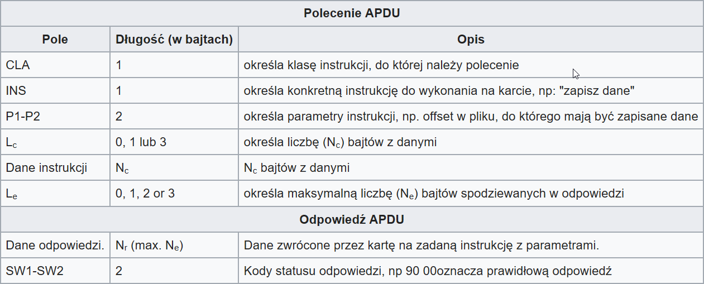
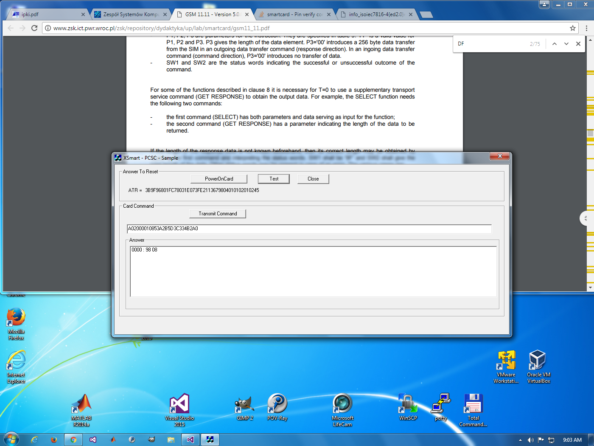

# Urządzenia peryferyjne
## Czytnik kart chipowych
#### Prowadzący:
* dr inż. Jan Nikodem

#### Autorzy:
Grupa F
* _Rodziewicz Bartosz, 226105_  
* _Ormaniec Wojciech, 226181_

#### Termin:
13 listopad 2017, 7:30

## 1. Wstęp
Karty chipowe które używaliśmy podczas laboratorium, są kartami używanymi w telefonach mobilnych - komórkowych. Mieliśmy dostępne trzy karty **SIM** na których pracowaliśmy podczas zajęć. Niestety po zajęciach nie byliśmy w stanie testować działania programu, ponieważ nie mieliśmy dostępu do czytnika kart chipowych, jednak program który przygotowaliśmy na zajęcia działał i sądzę, że pozostałe poprawki byłyby kosmetyczne więc nie powinny wpływać na działanie aplikacji.

### Teoria

> Karta chipowa to uniwersalny nośnik danych w postaci karty wykonanej z plastiku z umieszczonym na niej (lub wewnątrz niej) jednym lub kilkoma układami scalonymi (czipami), które pozwalają na ochronę procesu logowania użytkownika, kontrolę dostępu i zawartych na niej danych. Może być odczytywana za pomocą urządzeń automatycznych, np. przy zawieraniu i rozliczaniu transakcji finansowych oraz w kasach cyfrowych.

Karty chipowe są aktualnie popularnie używane w wielu dziedzinach, takich jak telefonia, bankowość czy nawet legitymacje studenckie. Karty chipowe, zwane również stykowymi, są kartami wyposażonymi w elektroniczny układ umożliwiający przechowywanie danych. Elektroniczne karty stykowe (`ISO 7816`) można podzielić na dwie grupy: karty pamięciowe, zawierające pamięć do przechowywania danych oraz karty procesorowe.

Podczas pracy z SC [Smart Card] natknęliśmy się na zagadnienie **ATR**, co po rozszyfrowaniu oznacza `Answer To Reset`. Służy on do komunikacji z kartą SC i podąża za standardem `ISO/IEC 7816`. ATR przekazuje informacje o parametrach komunikacji zaproponowanych przez kartę oraz o stanie karty oraz jej charakterze.

**APDU** -  struktura danych w protokole komunikacji między czytnikiem a kartą elektroniczną (np. między telefonem a kartą SIM). Struktura ramki APDU zdefiniowana jest w ISO/IEC 7816-4.  
Istnieją 2 kategorie APDU: polecenie APDU (od czytnika do karty) oraz odpowiedź APDU (od karty do czytnika). Polecenie APDU składa się z obowiązkowego nagłówka (4 bajty na pola: CLA, INS, P1, P2) i z opcjonalnej liczby danych (od 0 do 255 bajtów). Odpowiedź APDU stanowią 2 bajty statusowe oraz od 0 do 256 bajtów z danymi.



**Źródło:** [https://pl.wikipedia.org/wiki/Application_Protocol_Data_Unit](https://pl.wikipedia.org/wiki/Application_Protocol_Data_Unit)

## 2. Zadania do wykonania
### Uruchomienie przykładowej aplikacji
Aplikacja o której mowa zostanie omówiona w trzecim punkcie

### Uruchomienie SimEditor'a
Próbując odpalić wspomniany program, wystąpiły wielokrotne problemy, które jak się okazało, wynikały z niezgodoności karty z programem.

### Uruchomienie przykładowej aplikacji

Podczas pracy z aplikacją wykorzystywaliśmy dokumentację standardu `ISO 7816-4`. Klasa naszej karty to `A0`, co używam jako pierwszą informację przesyłaną w wiadomości (np:
```CPP
BYTE SELECT_SMS[] = { 0xA0, 0xA4, 0x00, 0x00, 0x02, 0x6F, 0x3C };
```
), gdzie `A4` to jest komenda `SELECT FILE`

Nadaliśmy też kod : `A0 20 00 01 08 53 A2 B5 D3 C3 34 B2 A0`
i otrzymaliśmy:



## Nasza aplikacja

Nasza aplikacja nie posiada interfejsu graficznego, jednak używa konsoli aby porozumiewać się z użytkownikiem. Okazało się to nadzwyczaj niefortunne i na pewno nie powtórzy się w przyszłych zadaniach, język C++ okazał się słabym wyborem do stworzenia aplikacji (dużo pracy, mało efektów).

### Aplikacja
Osobiście uważam, że najłatwiejszym sposobem opisania aplikacji jest opisania jej fragmentów kodu.

```cpp
    printf("SCardEstablishContext : ");
    rv = SCardEstablishContext(SCARD_SCOPE_SYSTEM, NULL, NULL, &hContext);

    if (rv != SCARD_S_SUCCESS)
    {
        printf("failed\n");
        return -1;
    }
    else printf("success\n");
```
Tworzymy kontekst (zgodnie z przykładem z MSDN https://msdn.microsoft.com/en-us/library/windows/desktop/aa379479(v=vs.85).aspx). Jeżeli połączenie zawiedzie, zwróci nam `error code`, a jeżeli się uda `SCARD_S_SUCCESS`.

```cpp
    printf("SCardListReaders : ");
    rv = SCardListReaders(hContext, mszGroups, mszReaders, &dwReaders);

    if (rv != SCARD_S_SUCCESS)
    {
        SCardReleaseContext(hContext);
        free(mszReaders);
        printf("failed\n");
        return -1;
    }
    else printf("success\n");
```

Pobieram listę czytników.

```cpp
    p = 0;
    for (i = 0; i < dwReaders - 1; ++i)
    {
        iReaders[++p] = i;
        printf("Reader %02d: %s\n", p, &mszReaders[i]);
        // przesuniêcie bufora do kolejnej nazwy czytnika
        while (mszReaders[++i] != '\0');
    }

    do
    {
        printf("Select reader : ");
        scanf("%d", &iReader);
    } while (iReader > p || iReader <= 0);
```

Wypisanie listy czytników, a następnie zebranie odpowiedzi użytkownika, aby czytać z odpowiedniego czytnika.

```cpp
    printf("SCardConnect : ");
    rv = SCardConnect(hContext, &mszReaders[iReaders[iReader]],
        SCARD_SHARE_SHARED, SCARD_PROTOCOL_T0 | SCARD_PROTOCOL_T1,
        &hCard, &dwPref);

    if (rv != SCARD_S_SUCCESS)
    {
        SCardReleaseContext(hContext);
        free(mszReaders);
        printf("failed\n");
        return -1;
    }
    else printf("success\n");
```

Nawiązanie połączenia z kartą zgodnie z: https://msdn.microsoft.com/pl-pl/library/windows/desktop/aa379473(v=vs.85).aspx, gdzie `&mszReaders[iReaders[iReader]]` to jest nasz wybrany czytnik kart.

### Przesyłanie danych

```cpp
    struct {
    BYTE
        bCla,   // the instruction class
        bIns,   // the instruction code
        bP1,    // parameter to the instruction
        bP2,    // parameter to the instruction
        bP3;    // size of I/O transfer
    } CmdBytes;
```

**Źródło:** https://msdn.microsoft.com/en-us/library/windows/desktop/aa379804(v=vs.85).aspx

Zgodnie z powyższą definicją structu `BYTE` będziemy przekazywać informację które nas interesują, przykładowo:

```cpp
    BYTE SELECT_TELECOM[] = { 0xA0, 0xA4, 0x00, 0x00, 0x02, 0x7F, 0x10 };
    printf("SCardTransmit : ");
    dwRespLen = 30;
    rv = SCardTransmit(hCard, SCARD_PCI_T0, SELECT_TELECOM,
        7, NULL, pbResp1, &dwRespLen);

    if (rv != SCARD_S_SUCCESS)
    {
        SCardDisconnect(hCard, SCARD_RESET_CARD);
        SCardReleaseContext(hContext);
        printf("failed\n");
        free(mszReaders);
        return -1;
    }
    else printf("success\n");
```

Zgodnie z: https://msdn.microsoft.com/en-us/library/windows/desktop/aa379804(v=vs.85).aspx

Akurat w tym wypadku wybieram plik - `0xA4`.

### Zakończenie procesu

```cpp

    printf("SCardEndTransaction : ");
    rv = SCardEndTransaction(hCard, SCARD_LEAVE_CARD);
    if (rv != SCARD_S_SUCCESS)
    {
        SCardDisconnect(hCard, SCARD_RESET_CARD);
        SCardReleaseContext(hContext);
        printf("failed\n");
        free(mszReaders);
        return -1;
    }
    else printf("success\n");

    printf("SCardDisconnect : ");
    rv = SCardDisconnect(hCard, SCARD_UNPOWER_CARD);

    if (rv != SCARD_S_SUCCESS)
    {
        SCardReleaseContext(hContext);
        printf("failed\n");
        free(mszReaders);
        return -1;
    }
    else printf("success\n");

    printf("SCardReleaseContext : ");
    rv = SCardReleaseContext(hContext);

    if (rv != SCARD_S_SUCCESS)
    {
        printf("failed\n");
        free(mszReaders);
        return -1;
    }
    else printf("success\n");

    return 0;

```

## 3. Wnioski
Po wykonaniu zadań, odkryliśmy jak wiele rzeczy trzeba brać pod uwagę, kiedy tworzymy aplikację do obsługi kart chipowych, a prawdopodobnie nawet jeszcze nie wiemy o funkcjonalnościach które można byłoby zaimplementować w takiej aplikacji, albo muszą się w takowej znajdować.

Nie mniej wykonaliśmy ją w zamyśle spełnienie wymagań zamieszczonych na stronie z ćwiczeniem. Definitywnie część kodu która została zaprezentowana, mogłaby zostać wykonana lepiej - jak chociażby wysyłanie komend, które są prostym przeklejaniem, jednak na potrzeby tego ćwiczenia, preferowaliśmy prostotę oraz czytelność (i zgodność z dokumentacją **MSDN**).

W obecnym ćwiczeniu, nabyliśmy umiejętności posługiwania się komendami APDU oraz poznaliśmy strukturę przechowywania danych w karcie sim, na której ćwiczenie było oparte.

## 4. Źródła:
* [https://pl.wikipedia.org/wiki/Karta_elektroniczna](https://pl.wikipedia.org/wiki/Karta_elektroniczna)

* [http://chipcard.pl/karty-chipowe](http://chipcard.pl/karty-chipowe)

* [https://pl.wikipedia.org/wiki/Application_Protocol_Data_Unit](https://pl.wikipedia.org/wiki/Application_Protocol_Data_Unit)
